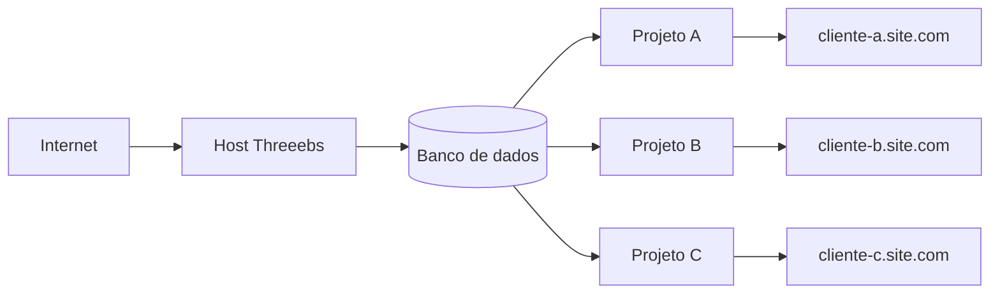

<p align="center">
  
</p>

# Threeebs :3

<p align="center">
  <a href="https://www.3eb.site">
    
  </a>

  <a href="https://docs.3eb.site">
    
  </a>

  <a href="https://identidade.3eb.site">
    
  </a>

  <a href="https://www.mahal.pro">
    
  </a>
</p>

Hoje você pode comprar um pequeno pedaço de terra na internet.

Você contrata uma **VPS**, registra um **domínio** e passa a ter um espaço seu onde pode construir projetos, hospedar aplicações e oferecer serviços para outras pessoas.

E, assim como em um terreno de verdade, você também pode dividir esse espaço.

Pode criar pequenos lotes para diferentes clientes, cobrar hospedagem mensalmente e oferecer serviços recorrentes como desenvolvimento, manutenção, automações e suporte.

O **Threeebs :3** é a ferramenta criada para ajudar você a administrar essa pequena propriedade digital.

Ele organiza:

- Clientes;
- Usuários;
- Projetos;
- Ambientes;
- Endereços;
- Serviços;
- e a infraestrutura que conecta tudo isso.

---

## 🌱 Entendendo a ideia

Imagine que você acabou de contratar uma VPS e possui o domínio:

```text
site.com
```

Você instala o Threeebs nesse servidor.

Depois cadastra:

```text
Cliente X
└── Projeto X
```

O projeto recebe um endereço:

```text
projetox.site.com
```

Quando alguém na internet acessa esse endereço, a requisição chega ao **Host do Threeebs**.

O Host pergunta ao banco:

> “Quem é responsável por `projetox.site.com` e qual ambiente eu devo entregar?”

O banco responde e o Host entrega os arquivos daquele ambiente.



Na prática, o fluxo é:

```text
cliente-a.site.com
        ↓
      Host
        ↓
   rotas_web
        ↓
    Ambiente
        ↓
     Projeto
        ↓
      Página
```

Você pode ter dezenas — ou centenas — de projetos compartilhando a mesma infraestrutura e o mesmo domínio base, cada um acessível através do seu próprio subdomínio.

```text
loja-maria.site.com
portfolio-joao.site.com
projeto-x.site.com
cliente-y.site.com
```

---

## 🌎 “Mas meu cliente quer usar o próprio domínio”

Sem problema, meu pequeno gafanhoto. :3

O projeto não precisa sair do Threeebs.

Em vez de acessar:

```text
projetox.site.com
```

o cliente pode utilizar:

```text
cliente.com
```

O domínio personalizado pode ser configurado através do Cloudflare para encaminhar o tráfego ao mesmo Host.

O Threeebs recebe:

```text
cliente.com
```

consulta suas rotas e continua chegando ao mesmo:

```text
Cliente X
└── Projeto X
    └── Ambiente Production
```

Ou seja:

```text
projetox.site.com ─────┐
                       ├──→ Host → Projeto X → Production
cliente.com ───────────┘
```

O endereço muda.

O projeto continua no mesmo ambiente.

---

## 🏠 Mas ninguém paga porque você tem um Host maneiro

Esse é o ponto mais importante.

Seu cliente provavelmente não está interessado em Docker, containers, rotas, bancos ou na arquitetura incrível que você montou.

Ele quer resolver um problema.

> “Quero meu site funcionando e não quero me preocupar com servidor.”

Então você não está vendendo apenas hospedagem.

Você pode vender:

**Produto + Recorrência**

Por exemplo:

```text
Site
+
Hospedagem
+
Manutenção
+
Suporte
```

Ou:

```text
Sistema
+
Infraestrutura
+
Banco de dados
+
Manutenção
```

Ou ainda:

```text
Landing Page
+
Hospedagem
+
Automações
+
Serviços recorrentes
```

Com o Threeebs, você pode criar um cliente, cadastrar um projeto, gerar um ambiente e disponibilizar um endereço para apresentação em poucos passos.

```text
Cliente
   ↓
Projeto
   ↓
Ambiente
   ↓
Endereço
   ↓
Internet
```

A estrutura central é simples:

> **Clientes possuem Usuários e Projetos.  
> Projetos possuem Ambientes.  
> Ambientes possuem Endereços e Serviços.  
> O Host recebe um endereço e descobre qual Ambiente deve servir.**

Simples. :3

> Plataforma em construção para quem cria na web.

Este é o repositório público oficial do **Threeebs :3**, nome técnico **3eb.site**.

## Estado atual

O projeto está em fase **PoC / Alpha**. Esta versão é experimental, pode conter falhas e ainda pode receber mudanças incompatíveis.

## Requisitos

- Docker Engine;
- Docker Compose v2;
- Bash.

## Instalação local

```bash
git clone https://github.com/Tiao-gpt/threeebs.git
cd threeebs
bash scripts/install.sh
```

Na primeira execução, o instalador cria o arquivo `.env` e interrompe o processo. Edite esse arquivo, substitua todos os valores iniciados por `TROQUE_` e execute novamente:

```bash
bash scripts/install.sh
```

A configuração de exemplo usa somente `127.0.0.1` e URLs locais. Depois da inicialização:

- Portal: `http://localhost:6011`
- Admin: `http://localhost:6015`
- Sandbox: `http://localhost:6016`
- Host/Preview: `http://localhost:6010`

Para verificar os serviços:

```bash
docker compose ps
```

Para encerrar:

```bash
docker compose down
```

O phpMyAdmin é opcional e pode ser iniciado com:

```bash
docker compose --profile tools up -d phpmyadmin
```

## Segurança

Nunca versione o arquivo `.env`, credenciais do Cloudflare, backups ou dados de produção. Consulte [SECURITY.md](SECURITY.md) para relatar vulnerabilidades.

## Contribuição

Leia [CONTRIBUTING.md](CONTRIBUTING.md) antes de abrir uma Issue ou Pull Request. Mudanças públicas relevantes são registradas em [CHANGELOG.md](CHANGELOG.md).

## Licença

Este repositório está sendo publicado **sem uma licença de código aberto**. O fato de o conteúdo estar publicamente visível não concede automaticamente permissão para copiar, modificar ou redistribuir o projeto.
