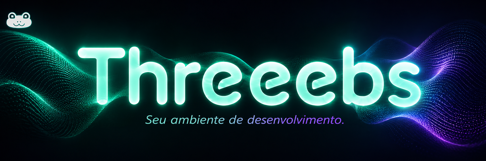

  

# Threeebs :3

  
  
  
  

O **Threeebs :3** ajuda você a transformar uma VPS e um domínio em uma pequena propriedade digital: um lugar para organizar clientes, projetos, ambientes, endereços e serviços recorrentes.

~~~mermaid
flowchart TD
    I[Internet] --> C[Cloudflare Tunnel]
    C --> P[Portal e Admin]
    C --> H[Host Threeebs]
    H --> R[Rotas dos projetos]
    R --> E[Ambientes dos clientes]
~~~

## Estado atual

O projeto está em fase **PoC / Alpha** e pode receber mudanças incompatíveis.

**Versão pública atual:** `v0.1.0`.

Existe também um canal Edge mais avançado, usado para validar recursos que ainda estão em desenvolvimento, incluindo automações e fluxos de envio de e-mail. Esses recursos não devem ser considerados estáveis até chegarem a uma versão pública.

## Comece por aqui

1. Confira os [requisitos de domínio, servidor e ferramentas](docs/01-requisitos.md).
2. Planeje o [domínio e os subdomínios](docs/02-dominio-e-subdominios.md).
3. Prepare o [servidor e o Docker](docs/03-servidor-e-docker.md).
4. Configure o [Cloudflare Tunnel](docs/04-cloudflare-tunnel.md).
5. Revise o [mapa de portas e as regras de segurança](docs/05-portas-e-seguranca.md).
6. Execute a [instalação e as atualizações](docs/06-instalacao-e-atualizacao.md).

~~~bash
git clone https://github.com/Tiao-gpt/threeebs.git
cd threeebs
bash scripts/install.sh
~~~

Na primeira execução, o instalador cria o `.env` e interrompe o processo. Preencha os valores iniciados por `TROQUE_` e execute o comando novamente. Em uma máquina sem `systemd`, use `bash scripts/install.sh --skip-operator`.

## Documentação

| Artigo | Conteúdo |
| --- | --- |
| [Índice da documentação](docs/README.md) | Ordem recomendada e visão da arquitetura |
| [Visão geral](docs/00-visao-geral.md) | Conceitos de cliente, projeto, ambiente e endereço |
| [Requisitos](docs/01-requisitos.md) | Domínio, servidor, Docker, Cloudflare e ferramentas |
| [Domínio e subdomínios](docs/02-dominio-e-subdominios.md) | Padrão de nomes e domínio próprio de clientes |
| [Servidor e Docker](docs/03-servidor-e-docker.md) | Topologia dos containers e preparação da VPS |
| [Cloudflare Tunnel](docs/04-cloudflare-tunnel.md) | Túnel, DNS wildcard e configuração de ingress |
| [Portas e segurança](docs/05-portas-e-seguranca.md) | Finalidade de cada porta e exposição recomendada |
| [Instalação e atualização](docs/06-instalacao-e-atualizacao.md) | Procedimentos operacionais e diagnóstico |
| [Recursos em desenvolvimento](docs/07-recursos-em-desenvolvimento.md) | Canal Edge, automações e critérios de estabilidade |

## Segurança e contribuição

Nunca versione `.env`, credenciais do Cloudflare, backups ou dados de produção. Consulte [SECURITY.md](SECURITY.md) para relatar vulnerabilidades e [CONTRIBUTING.md](CONTRIBUTING.md) antes de abrir uma Issue ou Pull Request. Mudanças públicas relevantes ficam em [CHANGELOG.md](CHANGELOG.md).

## Licença

Este repositório está publicado **sem uma licença de código aberto**. O conteúdo estar publicamente visível não concede automaticamente permissão para copiar, modificar ou redistribuir o projeto.
